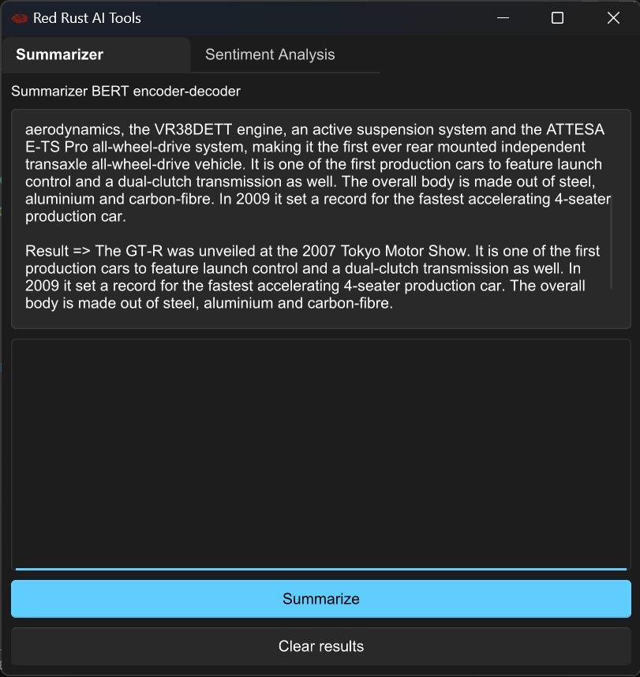
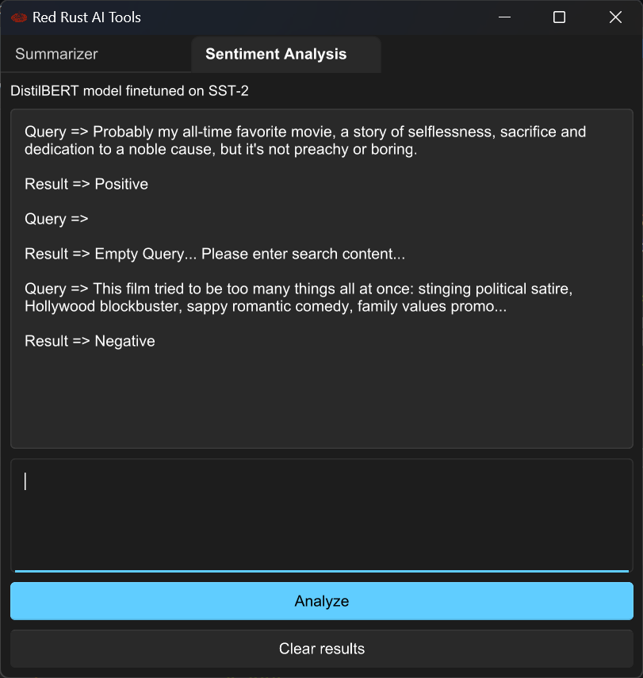

# Red Rust AI

Crate used: `rust-bert`

A simple Rust beginner project to work with the ML models and mainly the `slint-ui` for rust GUI.

Used slint to develop a desktop application integrating Machine learning models in rust programming language.

### Screenshots

